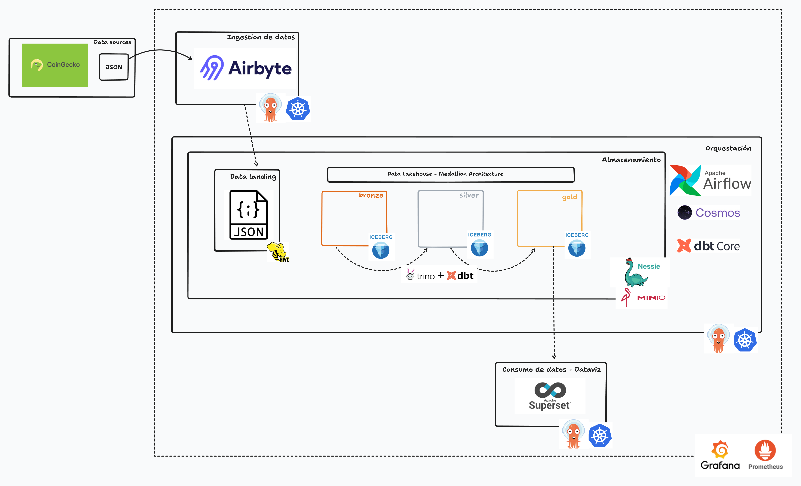

# My personal Data Lakehouse Repository

[Diagram](https://www.tldraw.com/ro/qudTb-BpITEDcpYnUOXZc?d=v-1885.-829.4706.2292.page)


## Directory Structure

The repository is organized into the following directories:

- **terraform**: Contains the Infrastructure as Code (IaC) configurations.
  - **gcp**: Contains configurations for Google Cloud Platform (GCP) GitOps using ArgoCD.
  - **azure**: Contains configurations for Azure GitOps using ArgoCD.
  - **gitops**: Contains general configurations for GitOps using ArgoCD.

- **minio**: Contains configurations and setups for MinIO.

- **hive-metastore**: Contains configurations for the metadata store, used by various components.

- **airbyte**: Contains configurations and setups for Airbyte, including connectors and deployments.

- **lab-airflow**: Contains configurations for Apache Airflow, DBT Core, and Astronomer Cosmos for local development and testing.

- **airflow**: Contains configurations and Directed Acyclic Graphs (DAGs) for Apache Airflow.
  - **dbt**: Contains dbt models and related configurations for data transformation.

- **observability**: Contains configurations related to monitoring and observability tools.
  - **infra**: 
    - **grafana**: Contains configurations for Grafana dashboards and monitoring setups using ArgoCD.
    - **prometheus**: Contains configurations for Prometheus monitoring setups using ArgoCD.

### Standard Service Structure
```
service/
│
├── argocd-app-manifest/
│   └── app.yaml
│
├── helm/
│   └── values.yaml
│
└── README.md
```

### Deploying ArgoCD Applications

After deploying the [Kubernetes cluster (in this case, using GCP)](https://github.com/victoru2/trino-lakehouse-lab/tree/main/terraform/gcp), [deploy ArgoCD](https://github.com/victoru2/trino-lakehouse-lab/tree/main/terraform/gitops/argocd) and then execute the following commands to deploy the necessary applications:

```sh
# Create namespaces
kubectl create namespace minio
kubectl create namespace orchestrator
```
### Apply secrets

Write the `MinIO` and `GitHub` username and password in `base64` format in the `example-secrets.yaml` file and rename it to `secrets.yaml`.
Then, apply the secrets with the following command:
```sh
kubectl apply -f secrets.yaml
```

### Application Deployment - Part 1
```sh
kubectl apply -f ./monitoring/infra/kube-prometheus-stack/argocd-app-manifest/app.yaml # Deploy the Prometheus Stack application
kubectl apply -f ./minio/argocd-app-manifest/app.yaml    # Deploy the MinIO application
kubectl apply -f ./airbyte/argocd-app-manifest/app.yaml   # Deploy the Airbyte application
kubectl apply -f ./hive-metastore/argocd-app-manifest/app.yaml # Deploy the Hive MetaStore application
kubectl apply -f ./nessie/argocd-app-manifest/app.yaml # Deploy the Nessie application
```
<!-- kubectl apply -f ./trino/argocd-app-manifest/app.yaml # Deploy the Trino application -->

### Edit S3 Credentials
- Open the values.yaml file and locate the following placeholder S3 credentials:
```sh
s3.aws-access-key=minio
s3.aws-secret-key=minio123
```

- Replace these values with your own S3 bucket credentials.

- Rename the file to trino-values.yaml.

- Execute the following command to install Trino:

```sh
helm install -f ./trino/helm/trino-values.yaml trino trino/trino --namespace warehouse --create-namespace --version 0.31.0
```
### Application Deployment - Part 2
```sh
kubectl apply -f ./airflow/argocd-app-manifest/app.yaml # Deploy the Airflow-DBT application
kubectl apply -f ./superset/argocd-app-manifest/app.yaml # Deploy the Superset application
```
### Note:
- Before activating the `Airflow DAG`, create the tables in the minio.landing schema, which are defined in the [landing_tables](https://github.com/victoru2/trino-lakehouse-lab/blob/main/airflow/dags/sql/landing_tables.sql) file.
